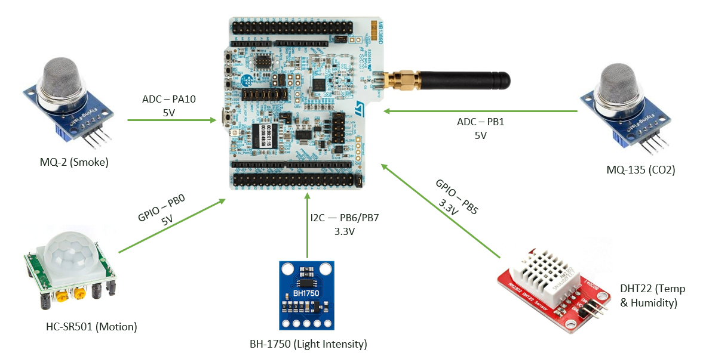
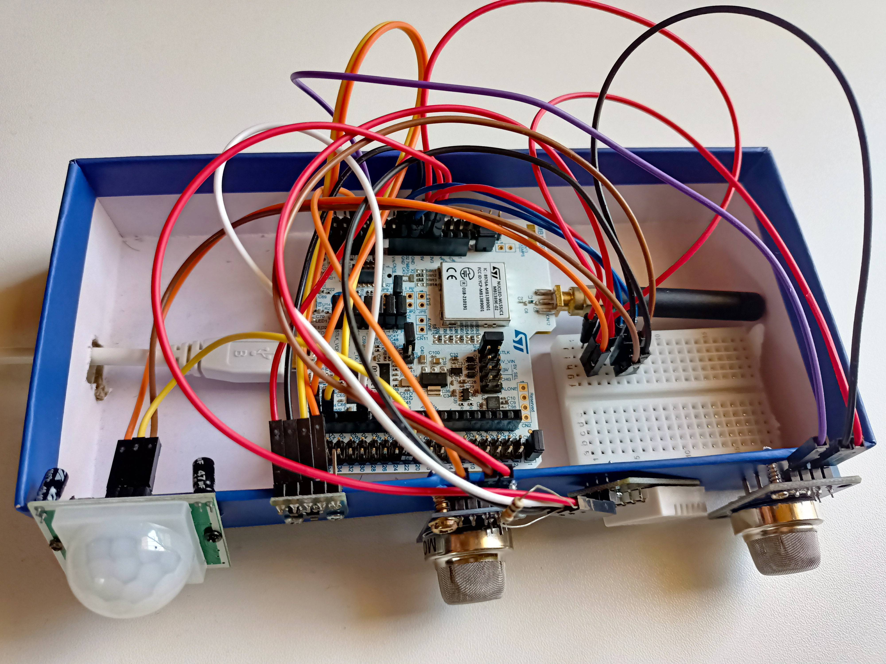
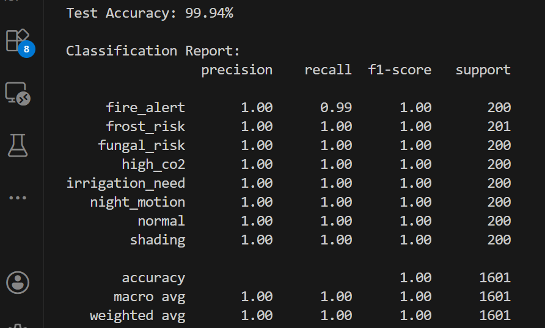
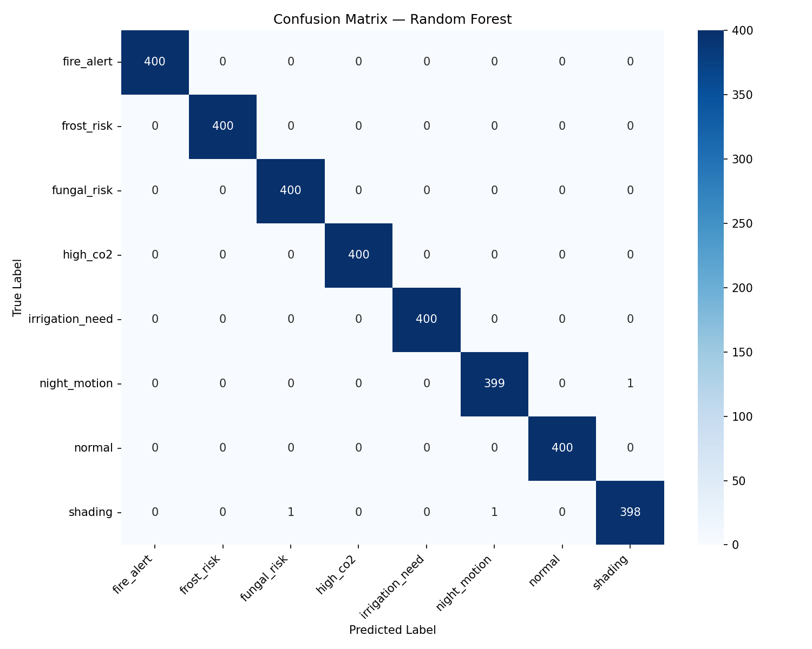
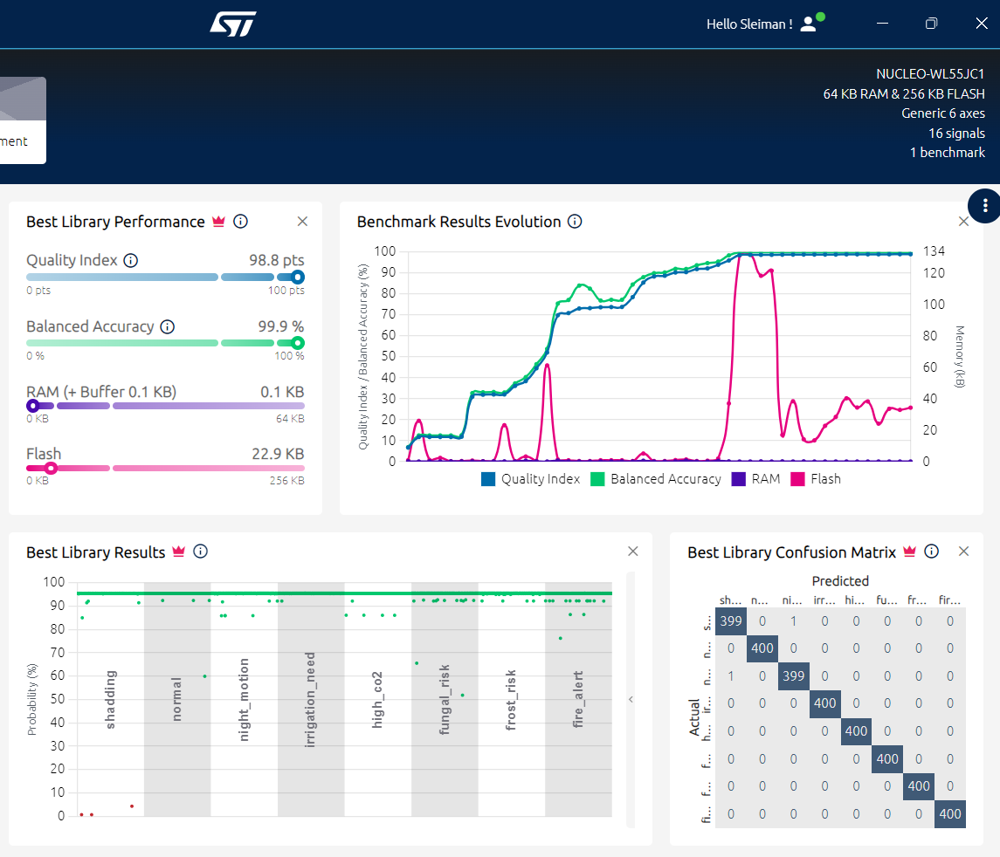
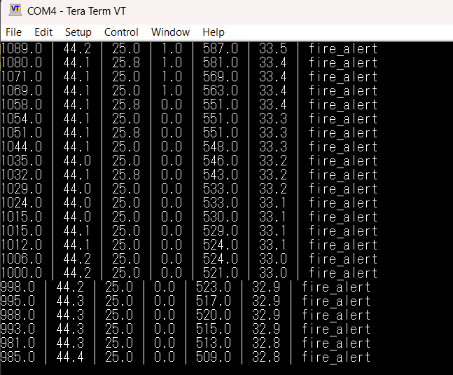
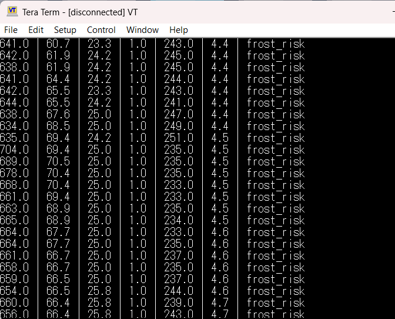
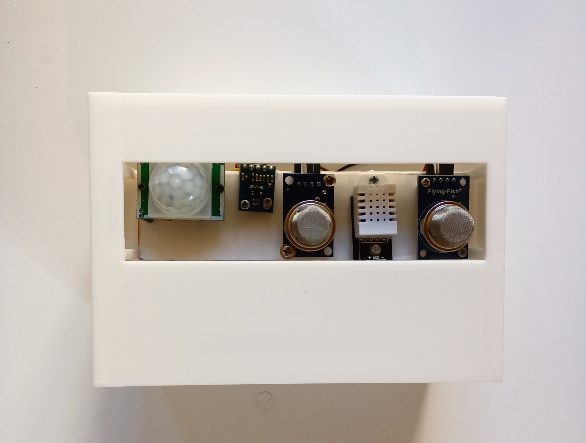

# Embedded Machine Learning for IoT Signals in Agricultural Applications

A complete embedded machine learning system for real-time environmental 
classification in agricultural settings, deployed on the STM32WL55JC 
dual-core microcontroller. The system classifies 8 distinct environmental 
conditions directly on edge.

---

## Literature Review

This project builds upon the following:

1. Cloud-based systems offer powerful ML processing but depend on internet connectivity and consume significant bandwidth and power.
2. Threshold-based systems are lightweight and inexpensive but often produce false alarms and lack adaptability.
3. Raspberry Pi/Jetson solutions achieve high ML performance but require higher power and cost compared to microcontrollers.
4. TinyML approaches enable ML on resource-constrained devices, though most existing work targets simpler sensing tasks than real-world environmental monitoring.

Our system combines TinyML-based edge processing, multi-sensor intelligence, low power consumption, and low cost on STM32 hardware, delivering accurate real-time environmental monitoring without cloud dependency.

---

## Overview

This project implements an edge AI pipeline that collects data from 5 
IoT sensors, runs inference locally using a NanoEdge AI model, and 
outputs the predicted environmental class over UART in real time.

**8 Environmental Classes:**
- 🔥 Fire Alert
- ❄️ Frost Risk
- 🍄 Fungal Risk
- 💨 High CO2
- 💧 Irrigation Need
- 🌙 Night Motion
- ✅ Normal
- 🌿 Shading

---
## Getting Started

### Hardware

| Component | Model | Interface |
|-----------|-------|-----------|
| Microcontroller Board | NUCLEO-WL55JC1 | — |
| CO2 Sensor | MQ-135 | ADC (PB1) |
| Smoke & Gas Sensor | MQ-2 | ADC (PA10) |
| Temperature & Humidity | DHT22 | GPIO (PB5) |
| Light Intensity | BH1750 | I2C (PB6/PB7) |
| PIR Motion | HC-SR501 | GPIO (PB0) |

### Software Prerequisites
- STM32CubeIDE
- STM32CubeMX
- NanoEdge AI Studio
- Python 3.x

### Data Collection
- Data was collected using the sensors deployed on the NUCLEO-WL55JC1 board.
- Sensor readings were transmitted via USART2 at 1 Hz and logged into CSV files, producing a labeled dataset of 16,000 samples across eight environmental classes (2,000 samples per class).
- Controlled physical scenarios were created for each class to generate realistic sensor patterns, with recordings performed under varying conditions to improve model generalization.

---

## ML Pipeline
Two independent training approaches were performed using NanoEdge AI Studio and Python to develop and evaluate the machine learning models.

### Python (scikit-learn)
- Algorithm: Random Forest (100 trees)
- Dataset: 16,000 samples (2,000 per class)
- Train/Test split: 80/20 stratified
- Normalization: StandardScaler
- **Test Accuracy: 99.94%**

| | |
|---|---|
| Python Training Results | Python Confusion Matrix |
|  |  |

### NanoEdge AI Studio
- Algorithm: RF (auto-selected)
- **Balanced Accuracy: 99.9%**
- RAM: 0.1 KB
- Flash: 29.1 KB
- Inference time: < 0.1 ms

---

## Firmware Implementation
The firmware main.c was developed in STM32CubeIDE using STM32 HAL drivers, with STM32CubeMX used for peripheral configuration.

### Code Functionality Overview (Step-by-Step)
1. System and Peripheral Initialization
   Initializes the STM32 HAL library, system clock, GPIO, ADC, I2C, Timer, and UART peripherals.
   Starts TIM2 for microsecond delays and initializes the BH1750 light sensor.
   Loads the NanoEdge AI classification model into memory.
   
2. Sensor Data Acquisition
   Reads environmental data from the five sensors.
   Collects six input features every second.
   
3. Data Preparation
   Stores the sensor readings in the NanoEdge AI input buffer.
   Ensures the sensor order matches the format used during model training.
   
4. Machine Learning Classification
   Sends the sensor data to the NanoEdge AI inference function(Library added from NanoEdge AI Studio to STM32CubeIDE).
   The embedded ML model analyzes the sensor pattern and predicts one of the trained environmental classes.
   
5. Real-Time Output
    Retrieves the predicted class name.
    Sends sensor values and classification results through UART.
    Displays the continuous monitoring output on a terminal such as Tera Term.
   
6. Continuous Operation
    The system repeats the sensing → classification → output cycle every 1 second for real-time environmental monitoring.

---

## Results

- The deployed NanoEdge AI model was validated on the NUCLEO-WL55JC1 board through real-time testing of all eight environmental classes. 
- UART outputs monitored via Tera Term showed sensor readings and predictions at 1 Hz, confirming consistent and accurate classification under controlled conditions.
- All 8 conditions were predicted correctly by the system
- Real-time classification output in Tera Term:

 

---

## Non Technical Aspects
- Economic feasibility:
  The system is cost-effective, with a total hardware cost of approximately $55.25 and free development tools, making it an affordable alternative to commercial monitoring solutions.
- Environmental sustainability:
  The low-power STM32-based design enables battery/solar-powered operation, reduces resource waste through precise monitoring, and extends hardware lifetime through software-based model updates.
- Ethical and social impact:
  The system improves access to precision agriculture, collects only environmental data without privacy concerns, and assists farmers in decision-making rather than replacing human control.

---

## Conclusion

This thesis developed a low-power embedded AI system on the STM32WL55JC for real-time agricultural environmental monitoring using five sensors and on-device classification of eight environmental states. The system achieved high accuracy through both Python-based validation (99.94%) and NanoEdge AI deployment (99.9% balanced accuracy), while maintaining minimal memory usage. Real-world testing confirmed reliable autonomous operation without cloud dependency, demonstrating the feasibility of TinyML for precision agriculture and IoT applications.

## License

This project is for academic purposes as part of a Master's thesis.
